# 01 — Hướng dẫn người mua

Địa chỉ: trang chủ ShopHub (dev: `http://localhost:18000/`). Mọi trang dùng được trên điện thoại (từ 375 px) và máy tính.

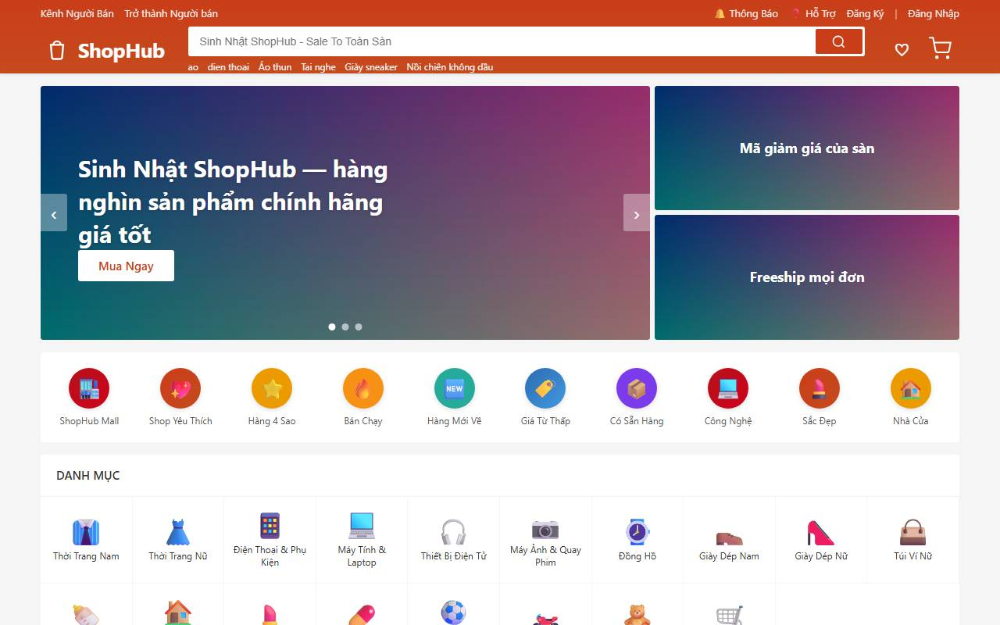

## 1. Tài khoản

**Đăng ký.** Bấm *Đăng Ký* → nhập số điện thoại → *Gửi mã* (OTP 6 số, hạn 5 phút, gửi lại sau 60 giây, sai quá 5 lần
phải gửi mã mới) → đặt mật khẩu (≥ 8 ký tự, có chữ và số), họ tên, đồng ý Điều khoản và Chính sách xử lý dữ liệu cá nhân.
Có thể đăng ký bằng email (mã gửi qua thư) hoặc **Đăng nhập bằng Google** nếu sàn đã bật.

**Đăng nhập.** Số điện thoại / email / tên đăng nhập + mật khẩu, hoặc tab *Đăng nhập bằng mã* (OTP qua SMS). Sai mật khẩu
nhiều lần tài khoản bị khoá tạm vài phút. Quên mật khẩu: *Quên mật khẩu* → mã OTP → mật khẩu mới (các thiết bị khác bị đăng xuất).

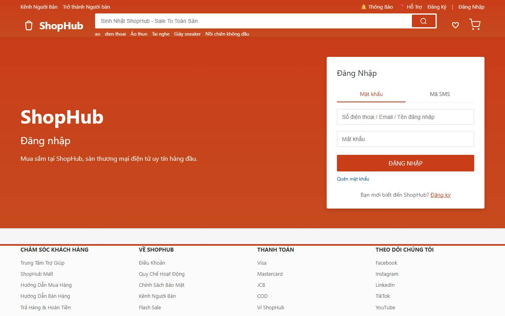

**Tài khoản của tôi** (bấm tên ở góc phải):

| Mục | Làm được gì |
|---|---|
| Hồ Sơ | Họ tên, giới tính, ngày sinh; **ảnh đại diện** (chọn ảnh → kéo thanh *Phóng to / Ngang / Dọc* để cắt khung vuông → *Lưu ảnh*, tối đa 1 MB); đổi SĐT / email (mã gửi tới liên hệ mới) |
| Địa Chỉ | Tối đa 10 địa chỉ, chọn Tỉnh → Quận → Phường, đặt mặc định |
| Đổi Mật Khẩu, Thiết Bị Đăng Nhập | Xem các thiết bị đang đăng nhập, đăng xuất từ xa |
| Cài Đặt Thông Báo | Bật / tắt từng loại (đơn hàng, khuyến mãi, ví, hệ thống) theo từng kênh (trong ứng dụng, email, SMS, push) |
| Ví ShopHub, ShopHub Xu, Ví Voucher | Số dư, nạp / rút tiền, tài khoản ngân hàng; xu & hạn dùng; voucher đã lưu |
| Quyền Riêng Tư | **Tải dữ liệu của tôi** (tệp JSON) và **yêu cầu xoá tài khoản** — xem mục 7 |

## 2. Tìm và xem sản phẩm

Ô tìm kiếm hiểu tiếng Việt **không dấu** ("dien thoai" ra "Điện Thoại…") và chịu được gõ sai 1–2 ký tự; gợi ý hiện ngay khi gõ.
Trang kết quả có bộ lọc kèm **số lượng thật** (danh mục, nơi bán, thương hiệu, khoảng giá, số sao, Mall / Yêu thích, dịch vụ…)
và sắp xếp Liên quan / Mới nhất / Bán chạy / Giá.

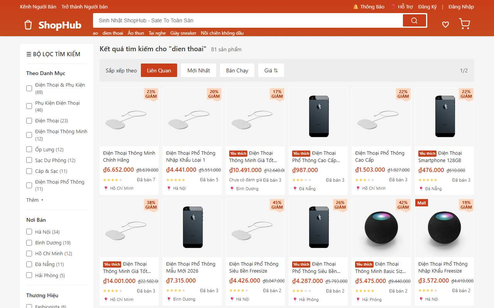

Trang sản phẩm: ảnh / video, giá theo phân loại đang chọn (giá Flash Sale hoặc giảm giá hiện đúng như khi thanh toán),
lựa chọn hết hàng bị làm mờ, số lượng không vượt tồn kho và **giới hạn mua mỗi người** (nếu shop đặt), phí vận chuyển ước tính
tới địa chỉ mặc định, voucher của shop (*Lưu*), đánh giá có lọc, sản phẩm tương tự. *Báo cáo sản phẩm* nếu thấy vi phạm.

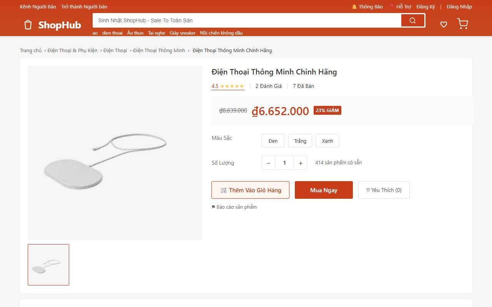

**Trang shop**: tab *Dạo* (trang trí của shop), *Tất Cả Sản Phẩm*, từng **danh mục của shop**, *Hồ Sơ Shop*; *Theo Dõi*,
*Chat Ngay*. Shop tạm nghỉ hiện băng thông báo và chưa đặt hàng được.

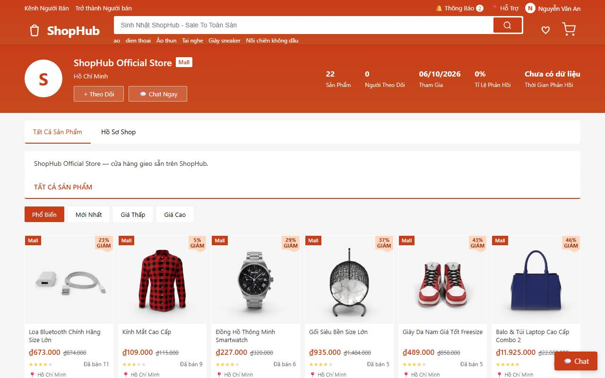

## 3. Giỏ hàng và thanh toán

Giỏ chia theo shop; chỉ dòng được tick mới tính tiền. Đổi phân loại ngay trong giỏ. Mỗi lần mở giỏ hệ thống kiểm lại: hết hàng,
đổi giá (giá cũ gạch ngang), sản phẩm ngừng bán, vượt giới hạn mua — dòng có vấn đề ghi rõ lý do; dòng hết hàng có nút
*Xem sản phẩm tương tự*. Chưa đăng nhập vẫn thêm giỏ được; đăng nhập thì giỏ được gộp vào tài khoản.

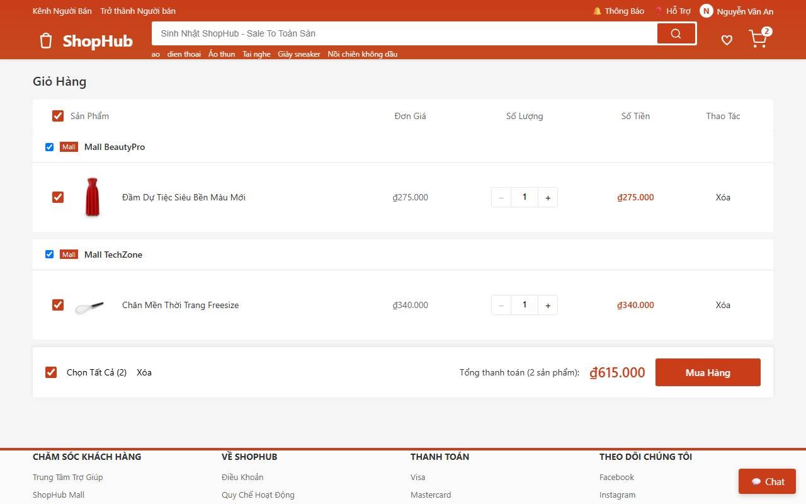

Trang thanh toán: địa chỉ nhận, mỗi shop một khối (lời nhắn, **đơn vị vận chuyển** với phí và ngày nhận dự kiến, voucher shop),
voucher của sàn (cả mã chưa dùng được kèm lý do, ví dụ "Mua thêm ₫35.000"), dùng Xu, phương thức thanh toán (COD, ví điện tử /
cổng thanh toán, Ví ShopHub). **Mọi con số do máy chủ tính**; nếu giá đổi trong lúc bạn đặt, hệ thống báo để bạn xác nhận lại.

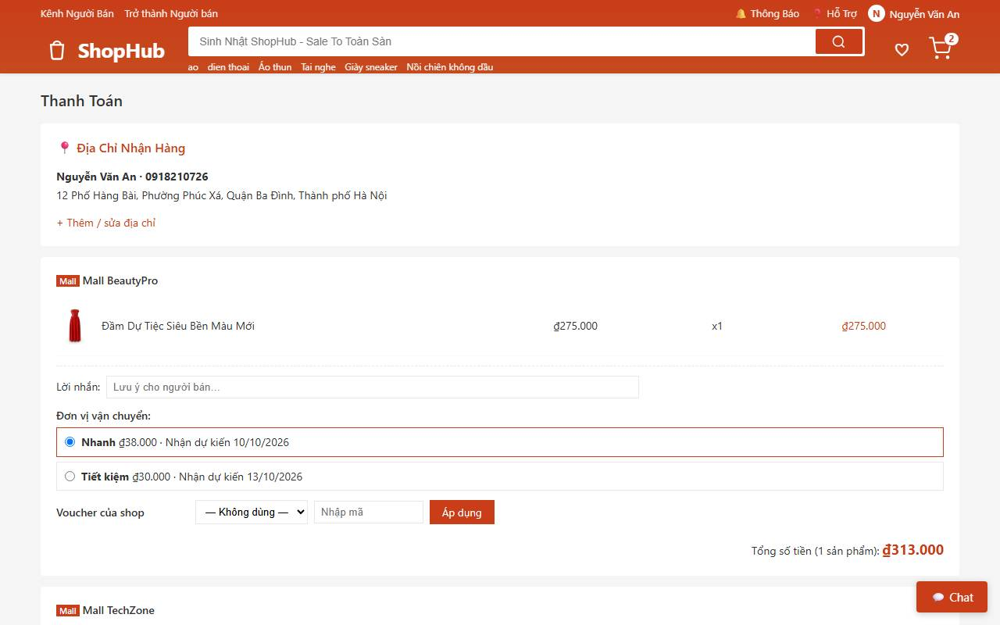

Mỗi shop thành **một đơn riêng** (mã `SH…`). Thanh toán online: chuyển sang cổng, có hạn trả tiền (mặc định 15 phút) — quá hạn đơn
tự huỷ và hàng được nhả lại.

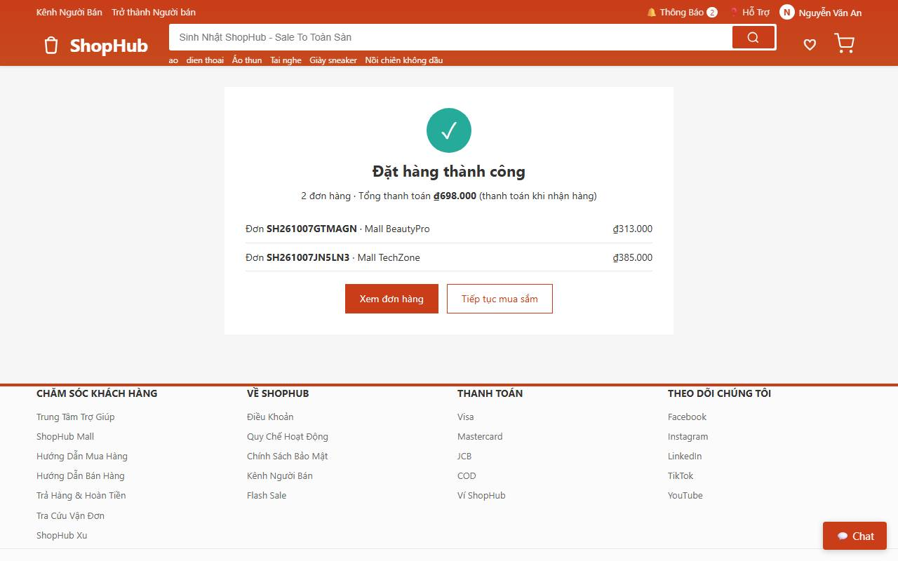

## 4. Đơn mua

*Tài khoản → Đơn Mua*: tab theo trạng thái, tìm theo mã đơn / tên shop / tên sản phẩm.

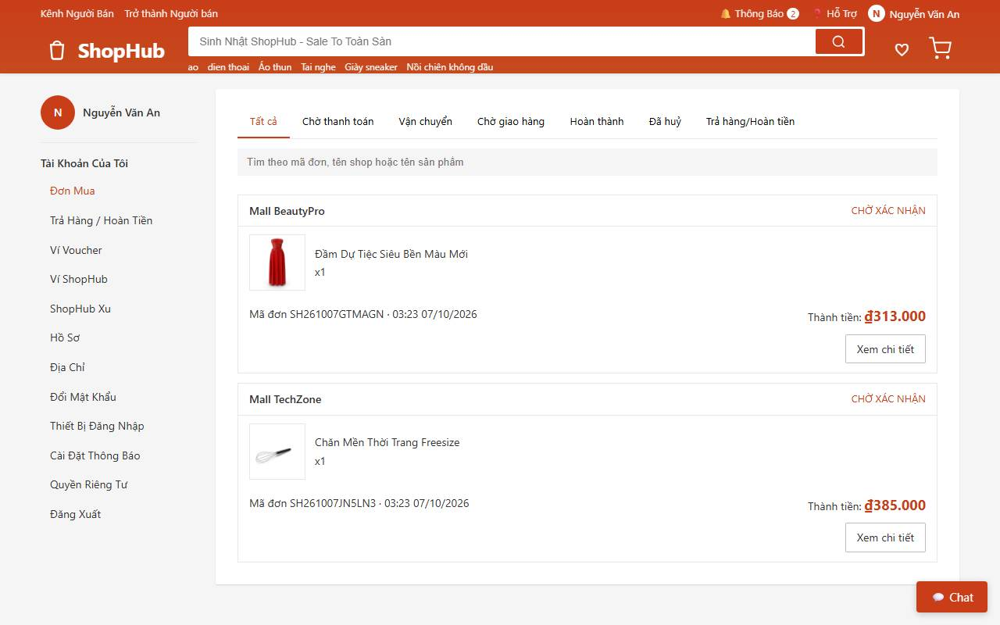

Chi tiết đơn: dòng thời gian trạng thái, hành trình vận đơn, bảng tiền. Nút hiện theo trạng thái:

| Nút | Khi nào |
|---|---|
| Thanh toán ngay | Đơn online chưa trả tiền, còn hạn |
| Huỷ đơn hàng / Yêu cầu huỷ | Huỷ ngay khi shop chưa xác nhận; sau đó là yêu cầu, shop trả lời trong 24 giờ (quá hạn tự chấp thuận) |
| Đã nhận được hàng | Đơn đã giao — xác nhận để hoàn tất (không bấm thì tự hoàn tất sau vài ngày) |
| Đánh giá | Đơn đã hoàn tất, mỗi sản phẩm một lần, sửa được một lần trong 30 ngày; đủ chữ + ảnh được thưởng xu |
| Trả hàng/Hoàn tiền | Trong 15 ngày sau khi nhận (mục 5) |
| Mua lại | Đưa cả đơn vào giỏ |
| **Liên hệ shop** | Mở chat với shop, gửi kèm thẻ đơn hàng |

Tra cứu vận đơn không cần đăng nhập: `/tra-cuu-van-don`.

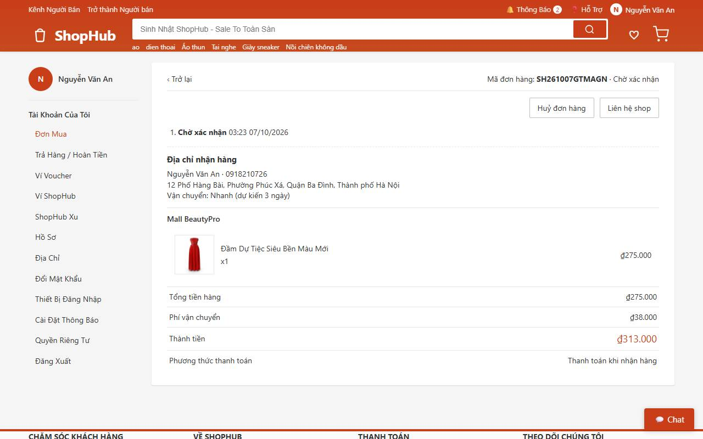

## 5. Trả hàng, hoàn tiền, khiếu nại

*Trả hàng/Hoàn tiền* → chọn sản phẩm và số lượng, lý do, ảnh / video bằng chứng, chọn *Chỉ hoàn tiền* hoặc *Trả hàng & hoàn tiền*.
Số tiền hoàn là **phần bạn đã thật sự trả** cho các dòng đó (sau giảm giá), về đúng nguồn: thẻ / cổng → hoàn qua cổng; COD / ví → Ví
ShopHub; xu → trả lại xu. Shop có thể đồng ý, từ chối hoặc đề nghị hoàn một phần; bị từ chối thì bấm *Khiếu nại* để sàn phân xử.
Trong yêu cầu có nút *Liên hệ shop*.

## 6. Chat với shop

Cửa sổ chat ở góc phải mọi trang (hoặc trang `/chat`): gửi chữ, ảnh, thẻ sản phẩm, thẻ đơn hàng; thấy *đã xem*, *đang soạn tin*.
Tin có số điện thoại / đường link ra ngoài được cảnh báo — giao dịch ngoài ShopHub không được bảo vệ. Nút **Chặn** (shop không gửi
tin được nữa) và **Báo cáo** (chọn lý do — sàn xem xét và có thể phạt shop).

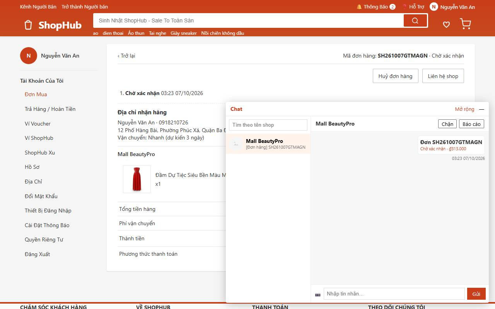

## 7. Ví, xu và quyền riêng tư

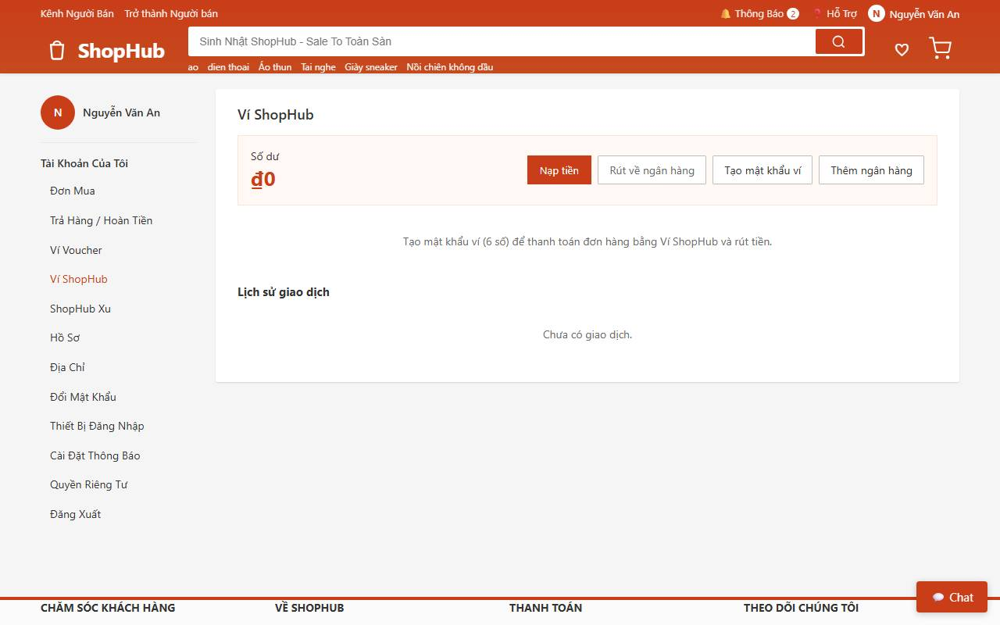

*Quyền Riêng Tư*: *Tải dữ liệu* (hồ sơ, địa chỉ, thiết bị, đơn hàng, đánh giá, yêu thích, shop theo dõi, ví, xu). *Yêu cầu xoá tài
khoản*: cần mật khẩu; bị từ chối kèm lý do khi còn đơn chưa xong, yêu cầu trả hàng đang mở, tiền trong Ví ShopHub hoặc lệnh rút
đang xử lý, hay bạn đang là chủ shop. Xoá là ẩn danh thông tin cá nhân, không khôi phục được; xu còn lại mất.

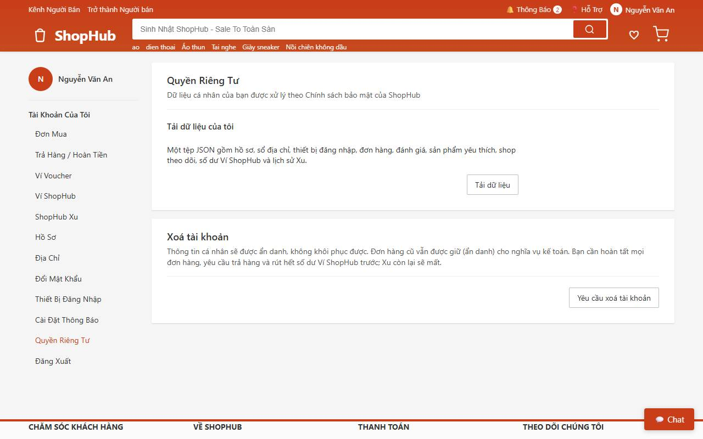

Trên điện thoại, biểu tượng Thông báo / Tài khoản nằm cạnh giỏ hàng, ô tìm kiếm ở hàng riêng:

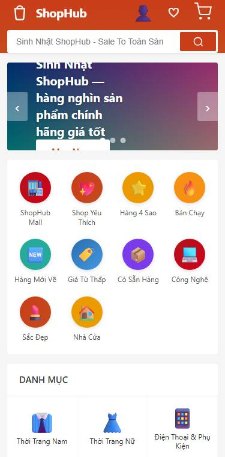
