# 02 — Hướng dẫn người bán (Kênh Người Bán)

Địa chỉ: `/seller/` (dev: `http://localhost:18000/seller/`), màn hình từ 1366 × 768. Đăng nhập bằng chính tài khoản ShopHub.
Một tài khoản có thể là chủ / nhân viên của nhiều shop — chọn shop ở ô trên cùng. Menu chỉ hiện các mục bạn được cấp quyền.

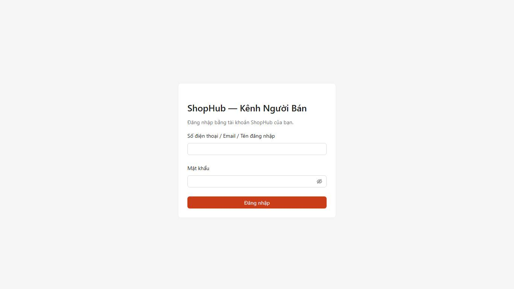

## 1. Mở shop

*Đăng ký shop mới*: tên shop (không trùng), loại (cá nhân / doanh nghiệp), địa chỉ lấy hàng, ảnh CCCD hai mặt (cá nhân) hoặc
giấy phép + mã số thuế (doanh nghiệp), tài khoản ngân hàng nhận tiền. Hồ sơ ở trạng thái *Chờ duyệt*; sàn duyệt hoặc từ chối kèm lý
do (gửi lại được). Giấy tờ lưu ở kho riêng tư, chỉ sàn xem được qua đường dẫn có hạn.

## 2. Bảng điều khiển

Việc cần làm (chờ xác nhận, chờ lấy hàng, yêu cầu huỷ, giao thất bại, sản phẩm bị khoá, sắp hết hàng), doanh số hôm nay / 7 / 30
ngày, điểm phạt hiện tại.

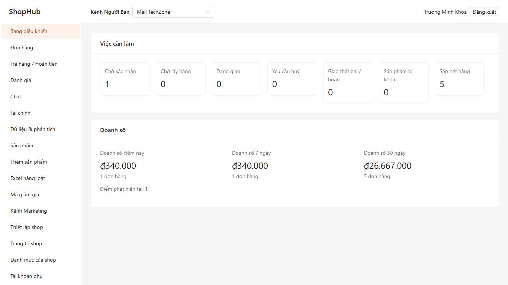

Bảng điều khiển còn có *Trả hàng chờ xử lý*, *Đã xử lý hôm nay*, lượt xem / người xem / tỉ lệ chuyển đổi theo ngày, 7 và 30 ngày,
và *Thông báo của sàn*. Ngưỡng *Sắp hết hàng* đặt riêng ở *Thiết lập shop* (để trống = mức chung của sàn).

## 3. Sản phẩm

Danh sách theo tab (Đang bán, Hết hàng, Chờ duyệt, Vi phạm, Đã ẩn, Nháp); sửa nhanh giá / tồn ngay trên bảng; ẩn / hiện / xoá;
lịch sử tồn kho theo SKU.

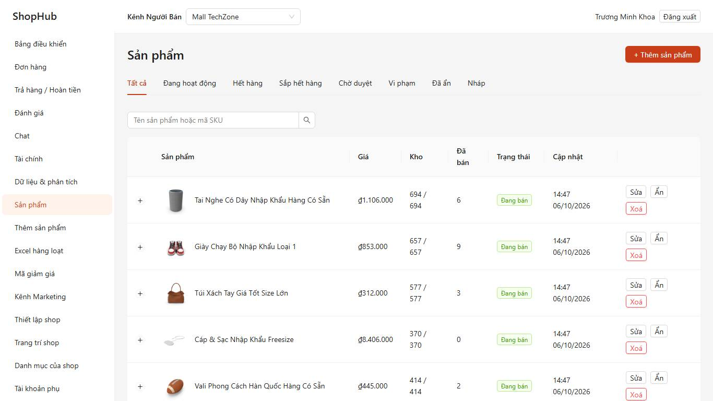

*Thêm sản phẩm*: chọn ngành hàng cấp cuối, 1–9 ảnh (ảnh bìa vuông) + video ≤ 30 giây, tên, mô tả, thuộc tính bắt buộc của ngành,
**tối đa 2 tầng phân loại** (ví dụ Màu × Size) → bảng SKU (giá, giá gốc, tồn, mã SKU), cân nặng & kích thước đóng gói, hàng đặt
trước, **giới hạn mua mỗi người**. *Lưu nháp* hoặc *Gửi duyệt* (lỗi được liệt kê trước khi gửi). Sửa tên / ảnh / ngành của sản
phẩm đã duyệt có thể phải duyệt lại.

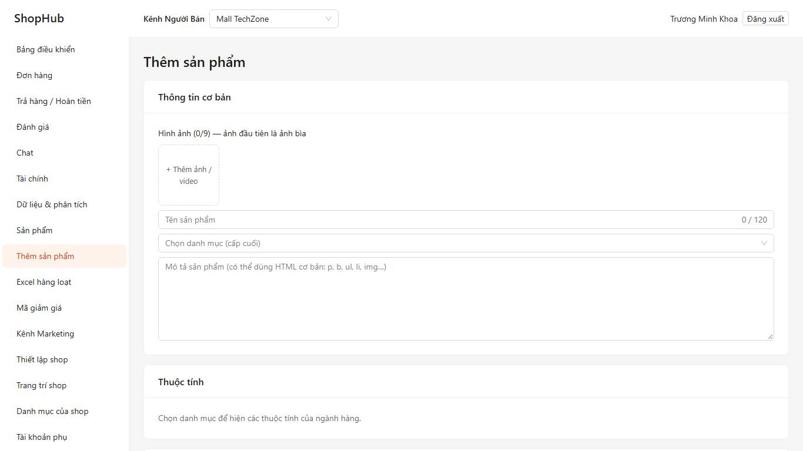

**Excel hàng loạt** (*Sản phẩm → Excel hàng loạt*):

- *Đăng sản phẩm*: chọn ngành → *Tải tệp mẫu* (cột thuộc tính đúng theo ngành, ô chọn có danh sách) → mỗi dòng một SKU; các phân
  loại của một sản phẩm dùng chung **Mã nhóm** (thông tin chung lấy ở dòng đầu nhóm); ảnh là link https cách nhau bởi `;` → tải
  lên. Việc chạy nền; sản phẩm hợp lệ được gửi duyệt, dòng lỗi hiện trong bảng (dòng, cột, lỗi). Tối đa 1.000 dòng / 5 MB.
- *Giá & tồn kho*: *Tải tệp giá & tồn kho* → sửa cột Giá / Giá gốc / Tồn kho (không sửa cột ID) → tải lên; mỗi thay đổi tồn được
  ghi vào lịch sử như khi sửa trên màn hình.

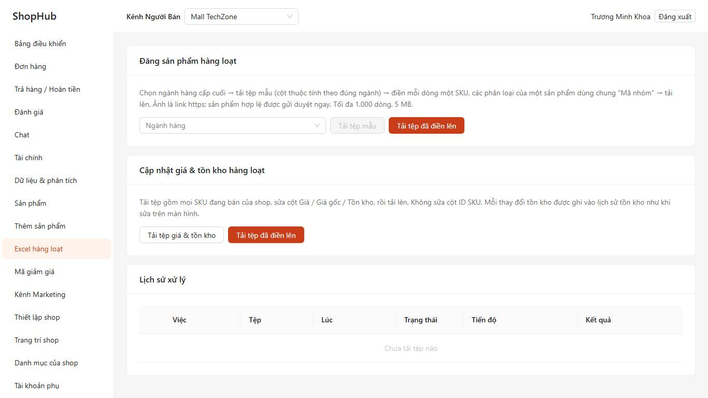

Danh sách sản phẩm lọc được theo tồn kho và giá; tick nhiều sản phẩm để *Ẩn / Hiện / Gửi duyệt / Xoá* một lần (tối đa 100, sản phẩm nào
không làm được thì báo riêng); *Sao chép* tạo bản nháp giống hệt nhưng tồn kho 0.

## 4. Đơn hàng

Tab theo trạng thái, lọc ngày / vận chuyển / thanh toán, tìm theo mã đơn, người mua, mã vận đơn; *Xuất Excel*.
**Chuẩn bị hàng**: chọn một hoặc nhiều đơn → lấy hàng tận nơi (chọn khung giờ) hoặc tự mang ra bưu cục → hệ thống tạo vận đơn
→ **In phiếu giao** (PDF A6/A5 có mã vạch) và **In phiếu soạn hàng** gộp nhiều đơn. Không chuẩn bị trong hạn (mặc định 2 ngày) đơn bị
tự huỷ và shop bị ghi điểm phạt. Yêu cầu huỷ của người mua: chấp thuận / từ chối trong 24 giờ.
Đơn gửi từ nhiều kho hiện nhãn *N kiện*; mỗi kiện được lấy, giao và theo dõi riêng — một kiện hoàn về trong khi kiện khác đã giao thì
hệ thống nhập lại kho và tự hoàn tiền phần hàng của kiện ấy cho người mua.

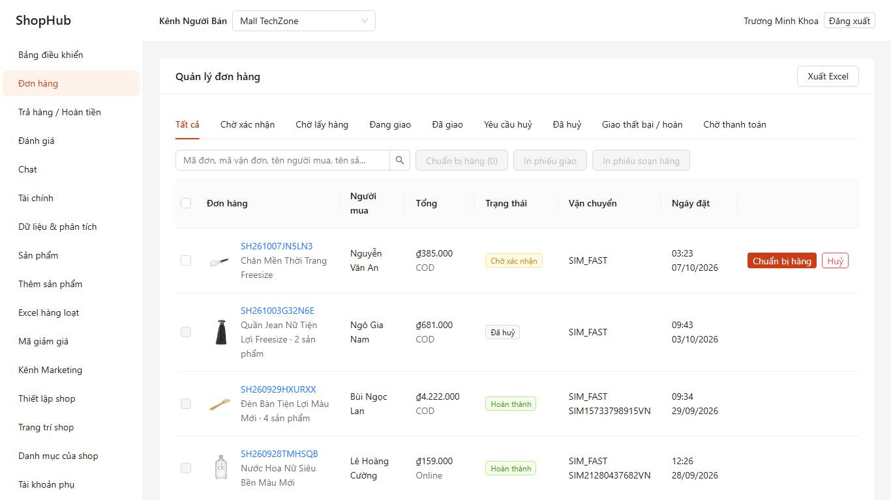

**Trả hàng / Hoàn tiền**: xem lý do và bằng chứng → *Đồng ý*, *Từ chối* (kèm bằng chứng) hoặc *Đề nghị hoàn một phần*; hàng trả về
thì *Xác nhận đã nhận hàng*. Đơn đang có yêu cầu trả hàng tạm khoá giải ngân phần liên quan.

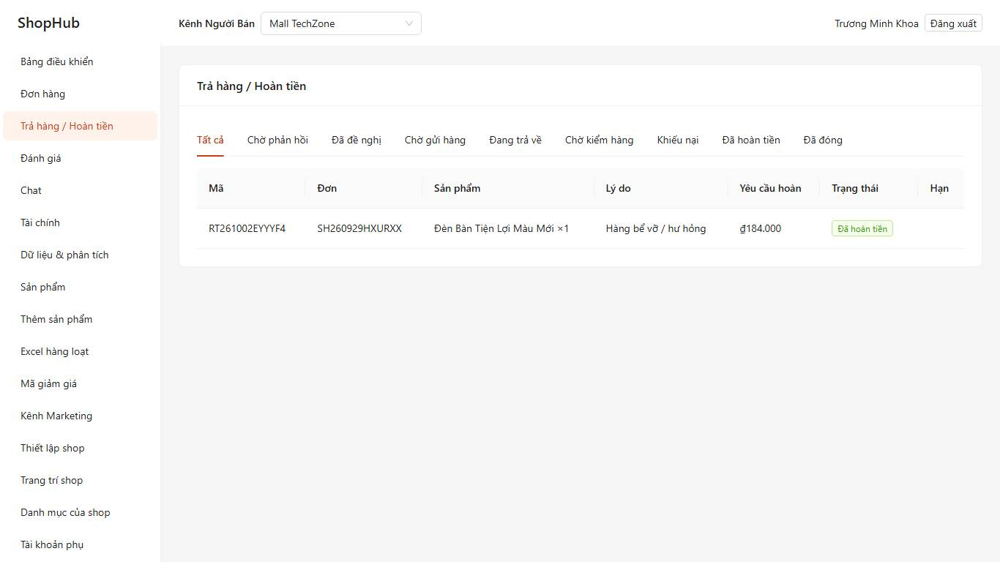

## 5. Marketing

- *Mã giảm giá*: toàn shop / theo sản phẩm / cho người theo dõi / riêng tư; xem lượt lưu, lượt dùng, doanh số.
- *Kênh Marketing*: chương trình giảm giá theo SKU, combo, mua kèm deal sốc, quà tặng, **Flash Sale của shop**; đăng ký **Flash
  Sale của sàn** (khung giờ, tiêu chí, trạng thái duyệt). Một SKU chỉ ở một chương trình giá tại một thời điểm — trùng thì bị báo.
- *Chương trình dịch vụ*: tham gia **Freeship Xtra** / **Voucher Xtra** — voucher miễn ship / giảm giá Xtra của sàn áp cho sản
  phẩm của shop, shop trả phí dịch vụ (mức phí hiện trên màn) cho các đơn đặt trong thời gian tham gia.

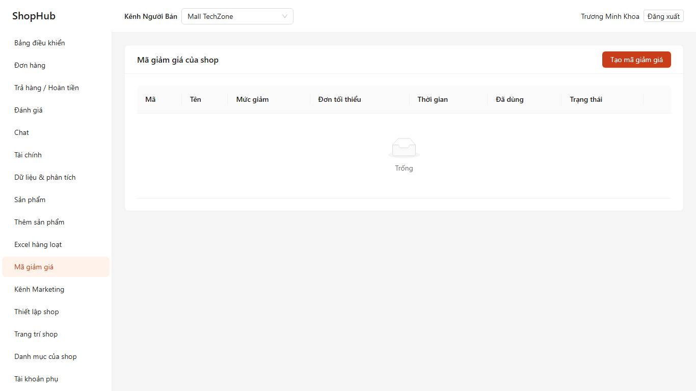
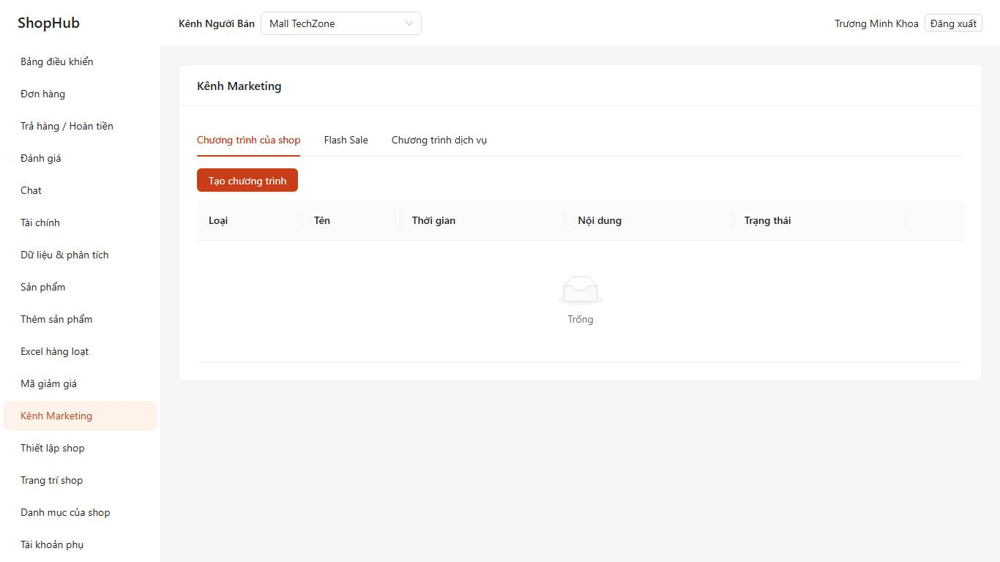

Mỗi mã giảm giá của shop hiện *lượt lưu*, số đơn đã dùng và *doanh số mang lại*.

*Chiến dịch của sàn* (Kênh Marketing): chọn sản phẩm đang bán để đăng ký vào ngày hội của sàn (tối đa 50), theo dõi *Chờ duyệt / Đã duyệt /
Từ chối* kèm lý do; sản phẩm được duyệt hiện trên trang chiến dịch. *Xuất Excel* đơn hàng chạy nền — trang tự tải tệp khi xong.

## 6. Chăm sóc khách hàng

Hộp chat của shop: nhiều nhân viên cùng trực, giao hội thoại cho người phụ trách, câu trả lời nhanh, tin tự động ngoài giờ.
*Đánh giá*: lọc theo sao / đã trả lời, trả lời một lần mỗi đánh giá.

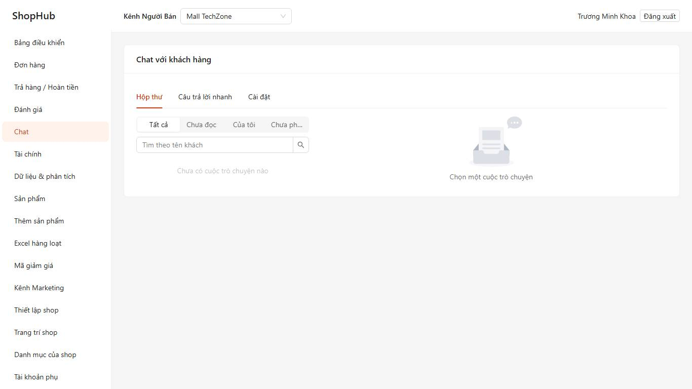
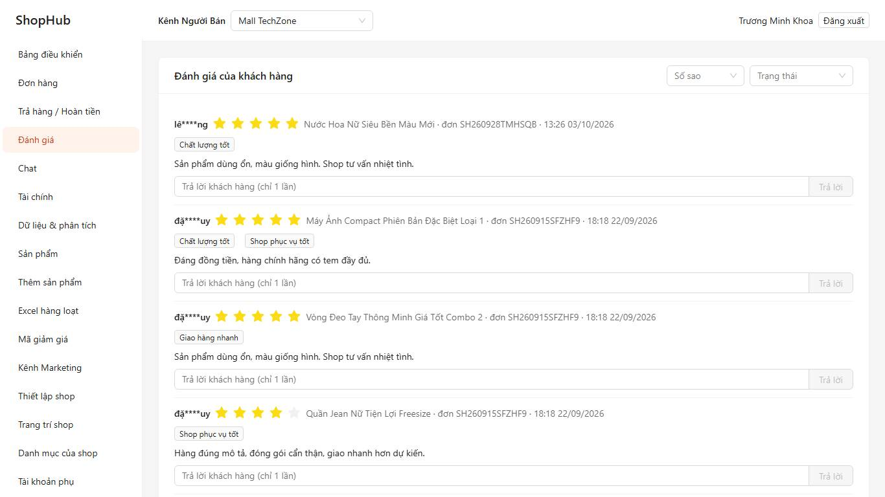

## 7. Tài chính

Doanh thu **chờ giải ngân** (đơn chưa hoàn tất hoặc còn trong hạn trả hàng) và **đã giải ngân**, chi tiết từng đơn: tiền hàng, giảm
giá shop chịu, phí cố định, phí thanh toán, phí dịch vụ, thực nhận. Số dư khả dụng, **Rút tiền** về tài khoản ngân hàng đã xác
minh (thêm tài khoản phải xác thực OTP), lịch sử rút, báo cáo đối soát theo kỳ (Excel + PDF).

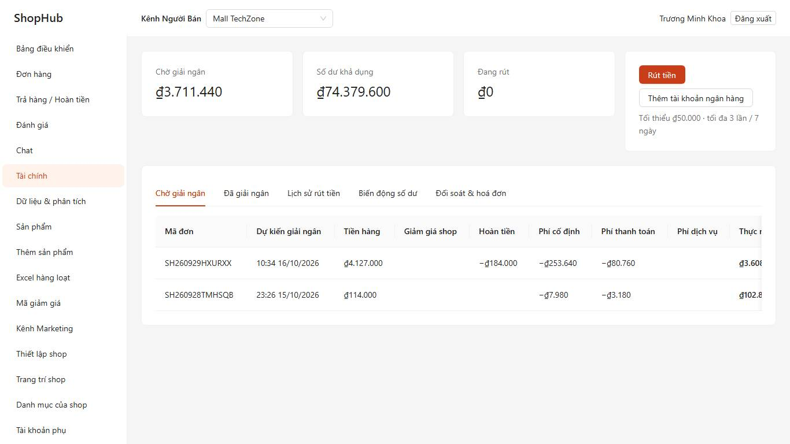

## 8. Dữ liệu & phân tích

Doanh số, đơn, người mua, lượt xem, tỉ lệ chuyển đổi theo ngày / tuần / tháng so với kỳ trước, top sản phẩm, nguồn truy cập, xuất
Excel; tab *Hiệu quả hoạt động*: đơn không thành công, giao trễ, phản hồi chat, điểm phạt và hậu quả theo ngưỡng.

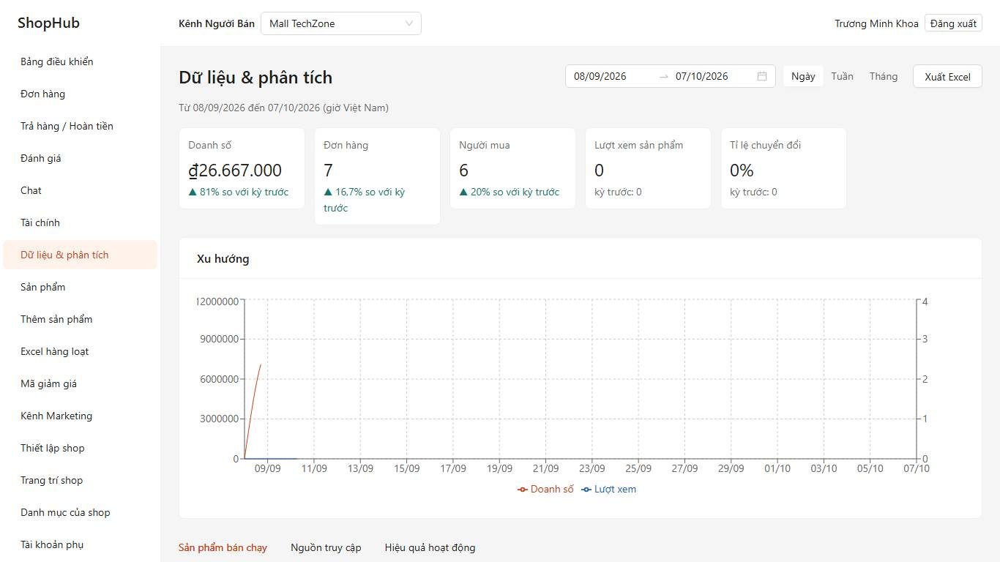

## 9. Thiết lập shop

| Mục | Nội dung |
|---|---|
| Thiết lập shop | Logo, ảnh bìa, giới thiệu; **chế độ tạm nghỉ** (người mua vẫn xem được, không đặt hàng được) |
| Trang trí shop | Các khối của tab *Dạo*: Banner (1–5 ảnh, link trong ShopHub), Sản phẩm nổi bật (≤ 12), Danh mục của shop, Video, Đoạn chữ; kéo thả hoặc ↑ ↓ để sắp xếp → *Đăng* |
| Danh mục của shop | Tối đa 30 danh mục, mỗi danh mục ≤ 500 sản phẩm theo thứ tự bạn chọn; danh mục hiển thị và có hàng thành tab trên trang shop |
| Kho hàng & vận chuyển | Tối đa 10 kho; một kho **lấy hàng mặc định** và một **địa chỉ nhận hàng trả**. Bật **Đa kho** (cần ≥ 2 kho) rồi chọn *Kho gửi* trong trang sửa sản phẩm: đơn có hàng ở nhiều kho được gửi thành nhiều kiện, mỗi kiện một vận đơn và một phiếu giao, phí ship tính riêng từng kiện. Bật / tắt từng **đơn vị vận chuyển** và **COD** của shop; trang sửa sản phẩm còn giới hạn được đơn vị vận chuyển cho sản phẩm ấy |
| Tài khoản phụ | Thêm nhân viên bằng SĐT / email tài khoản ShopHub của họ, vai trò Quản lý / CSKH / Kho với quyền mặc định chỉnh được (không cấp được quyền mình không có); gỡ có hiệu lực ngay |

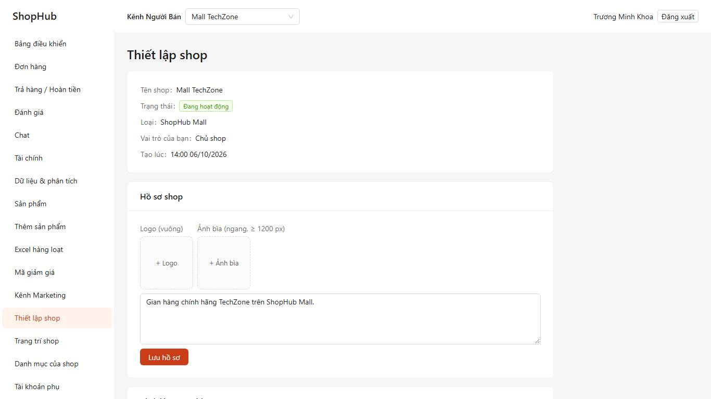
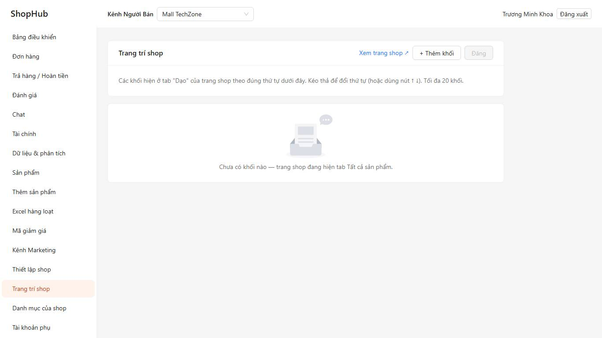
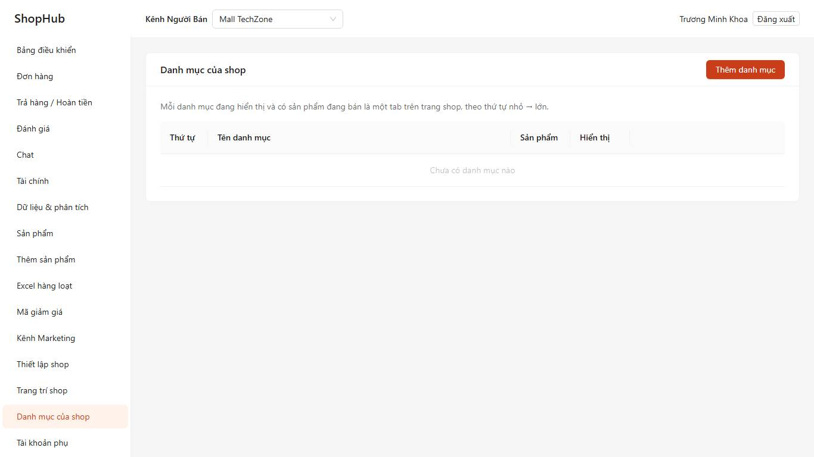
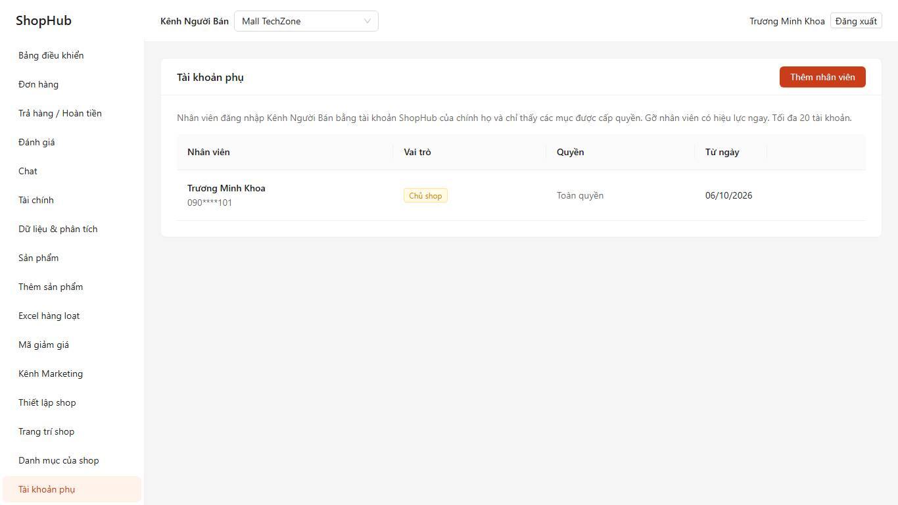
