# 03 — Hướng dẫn quản trị sàn

Địa chỉ: `/admin/` (dev: `http://localhost:18000/admin/`), màn hình từ 1366 × 768. Tài khoản `admin` phải đổi mật khẩu ở lần đăng
nhập đầu. Menu hiện theo quyền của vai trò; mọi thao tác ghi đều vào **Nhật ký thao tác**.

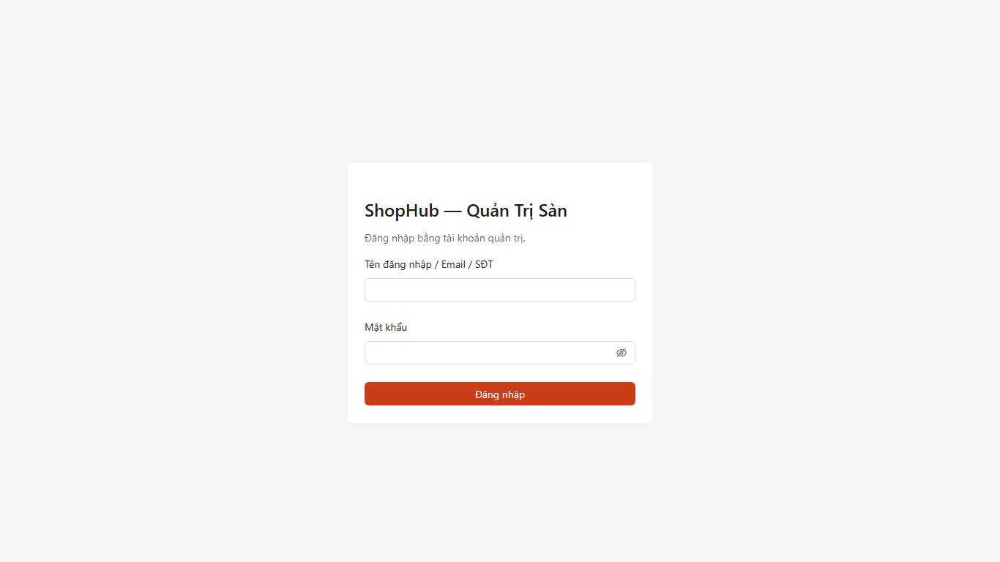

## 1. Tổng quan và báo cáo

*Tổng quan*: GMV, số đơn, người dùng mới, shop mới, tỉ lệ huỷ / trả hàng, doanh thu phí — so với kỳ trước; biểu đồ theo ngày /
tuần / tháng (giờ Việt Nam); việc chờ xử lý (shop / sản phẩm chờ duyệt, khiếu nại, rút tiền, báo cáo vi phạm).

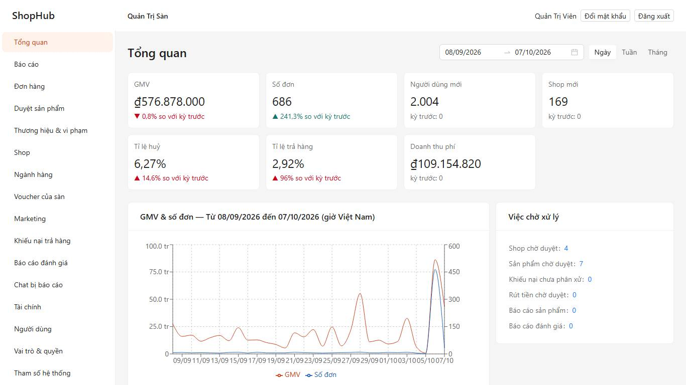

*Báo cáo*: GMV theo thời gian / ngành / tỉnh, top shop, top sản phẩm, hiệu quả voucher và Flash Sale, huỷ / trả hàng theo shop và lý
do, người dùng mới & quay lại, phễu chuyển đổi (xem → giỏ → đặt → trả tiền). Mỗi báo cáo có bảng, biểu đồ, xuất Excel / PDF; khoảng
ngày tối đa 366 ngày.

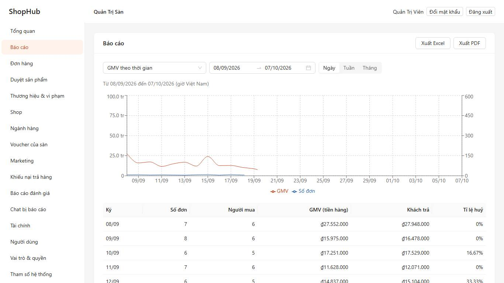

## 2. Đơn hàng và khiếu nại

*Đơn hàng*: tìm theo mã đơn, mã vận đơn, SĐT / tên người mua, tên shop; xem toàn bộ lịch sử trạng thái, thanh toán, vận đơn.
Can thiệp (huỷ đơn, xử lý hoàn tiền lỗi) cần quyền riêng `SALES.ORDER.INTERVENE` và lý do.

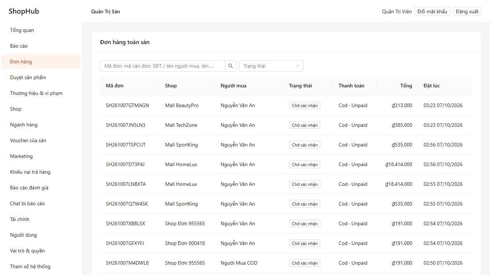

*Khiếu nại trả hàng*: xem bằng chứng hai bên → quyết định (hoàn toàn bộ / một phần / không hoàn, có yêu cầu gửi hàng về hay không)
kèm lý do. Tiền hoàn tính theo phần người mua đã trả sau giảm giá.

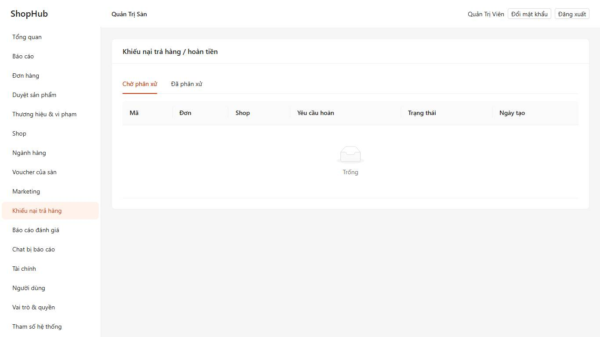

*Chat bị báo cáo*: đọc hội thoại (**mỗi lần mở được ghi nhật ký**) → *Không vi phạm* hoặc *Ghi điểm phạt* cho shop; một quyết định
đóng mọi báo cáo của cùng hội thoại.

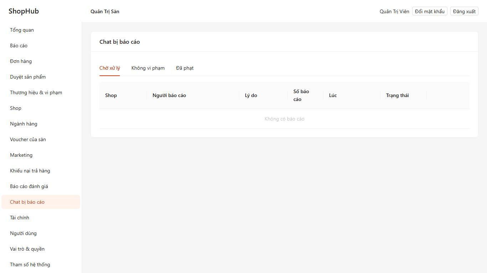

## 3. Shop, ngành hàng, sản phẩm

*Shop*: duyệt / từ chối đăng ký (xem giấy tờ KYC qua đường dẫn có hạn), khoá / mở khoá, nhãn **Mall** / **Yêu thích**, điểm phạt
(ghi, gỡ, lịch sử; ngưỡng hạn chế hiển thị / cấm chiến dịch / khoá là tham số).

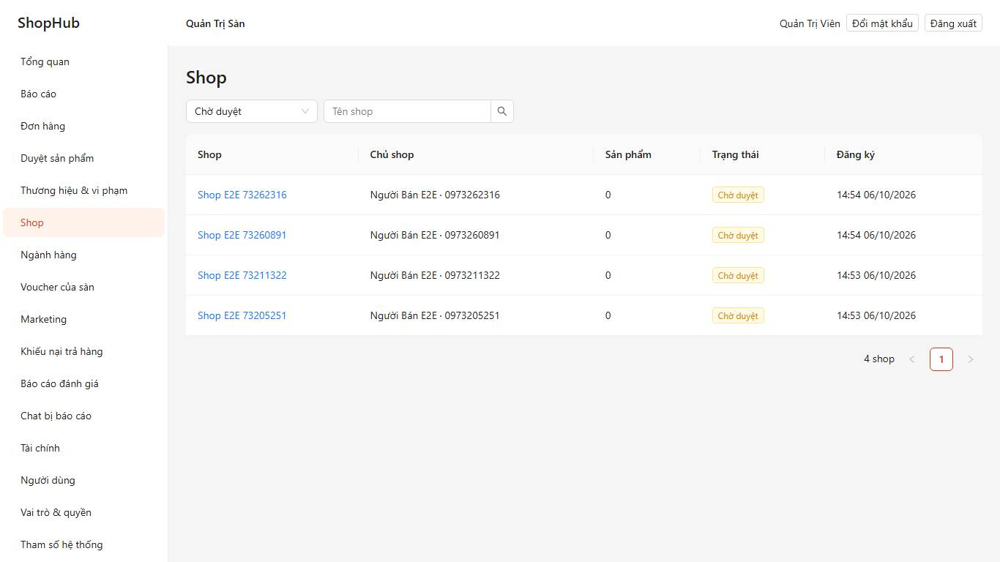

*Ngành hàng*: cây danh mục 3 cấp kéo thả, thuộc tính theo ngành (bắt buộc / lọc được / kiểu nhập), thương hiệu.
*Duyệt sản phẩm*: hàng đợi duyệt (duyệt / từ chối / yêu cầu sửa kèm lý do), lọc sản phẩm bị gắn cờ từ khoá cấm; *Thương hiệu & vi
phạm*: báo cáo sản phẩm của người mua, khoá hàng loạt.

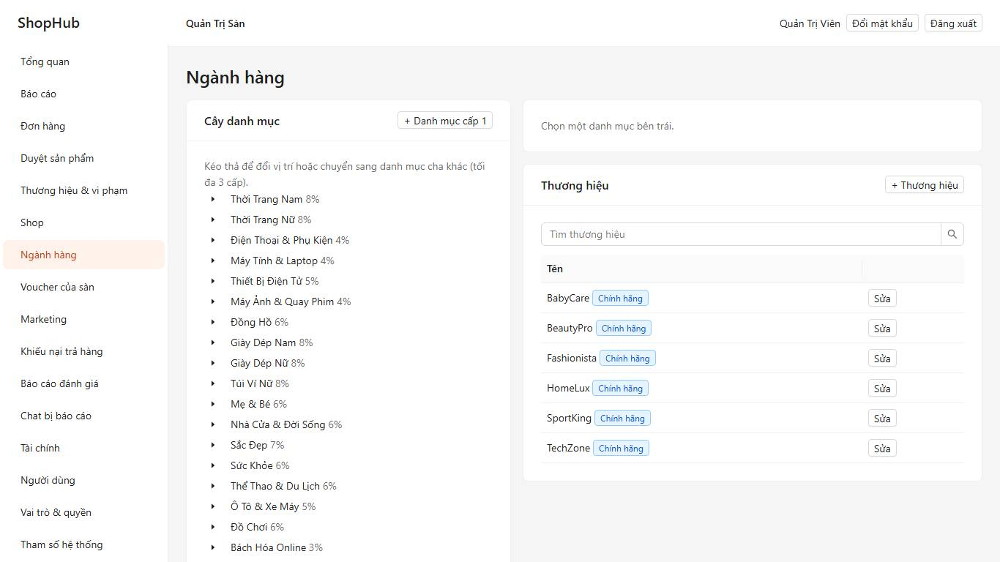
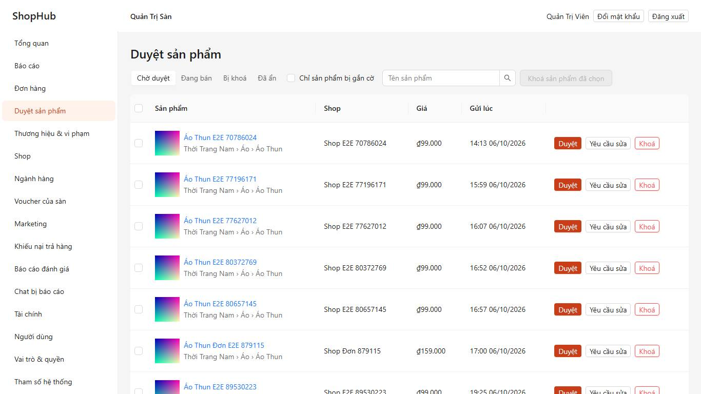

## 4. Marketing của sàn

*Voucher của sàn*: giảm tiền / % có trần / miễn ship / hoàn xu, đơn tối thiểu, thời gian, tổng lượt, lượt mỗi người, người dùng mới,
**chỉ shop tham gia Xtra**. *Marketing*: khung Flash Sale và duyệt đăng ký của shop, chiến dịch (trang `/su-kien/…`), banner, popup
(tần suất), lối tắt trang chủ, từ khoá hot, thông báo hàng loạt theo phân khúc.

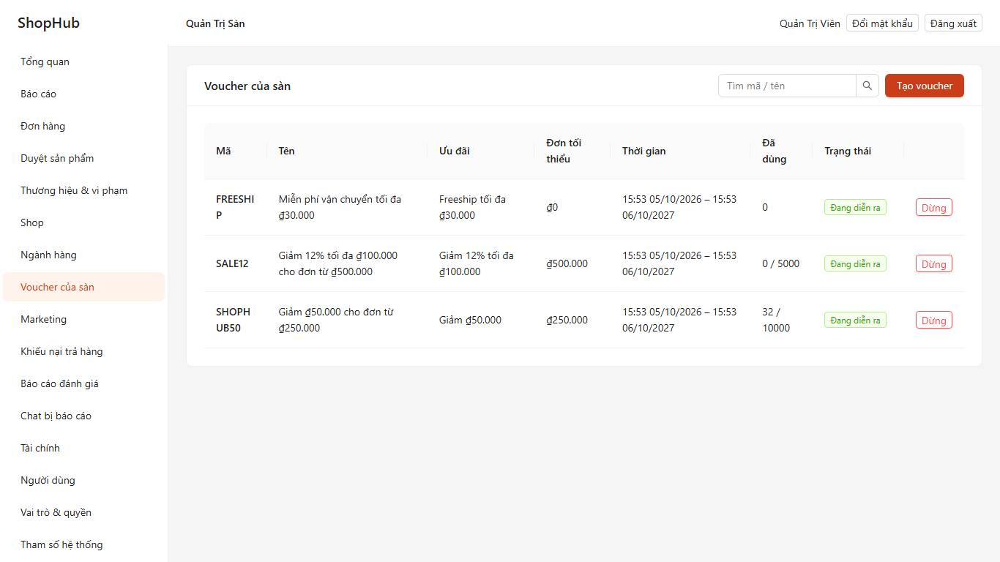
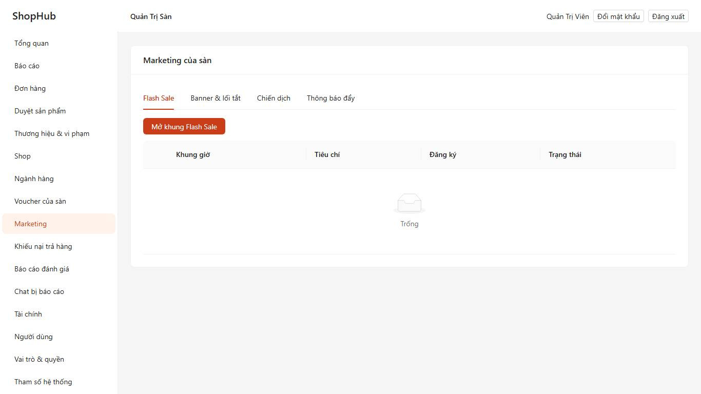

## 5. Tài chính

Biểu phí theo ngành có ngày hiệu lực (phí cố định, phí thanh toán, phí dịch vụ Freeship Xtra / Voucher Xtra), duyệt rút tiền, sổ cái,
đối soát với cổng thanh toán và đơn vị vận chuyển (tải tệp sao kê CSV → liệt kê giao dịch lệch).

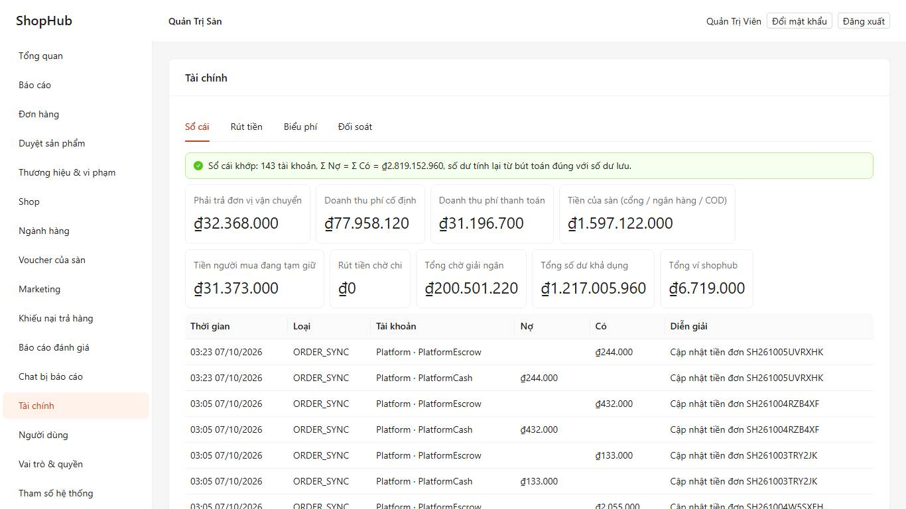

## 6. Người dùng, vai trò, nhật ký

*Người dùng*: tìm, xem đơn / đánh giá / vi phạm / thiết bị; khoá (cắt phiên đang mở ngay) / mở khoá kèm lý do; **đặt lại mật khẩu**
(mật khẩu tạm hiện một lần, buộc đổi khi đăng nhập). *Vai trò & quyền*: Quản trị cao nhất, Vận hành, Duyệt nội dung, CSKH, Kế toán,
Marketing — cây quyền `MODULE.ENTITY.ACTION`. *Nhật ký thao tác*: lọc theo người / hành động / đối tượng / thời gian, xem khác biệt
cũ – mới, xuất Excel.

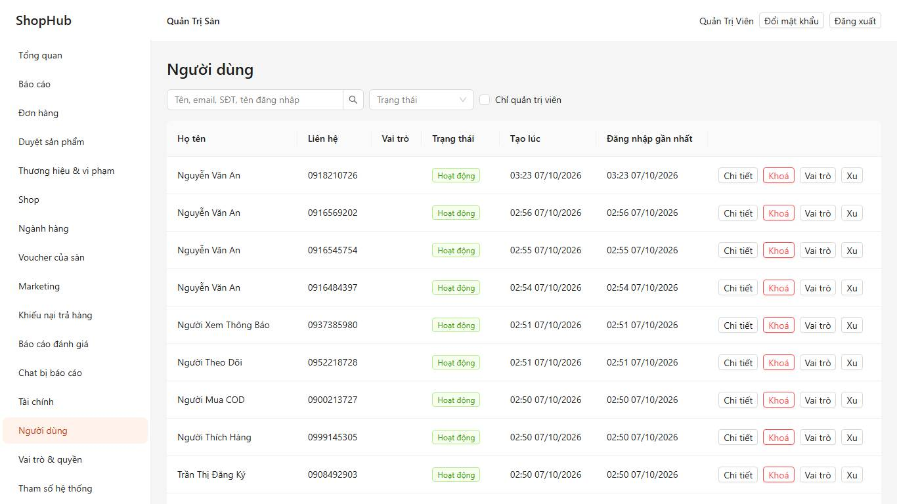
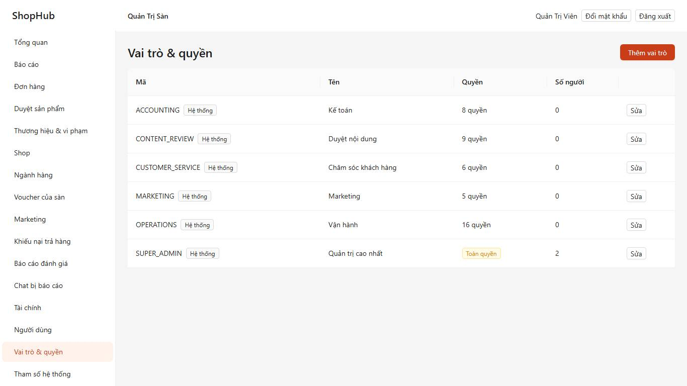
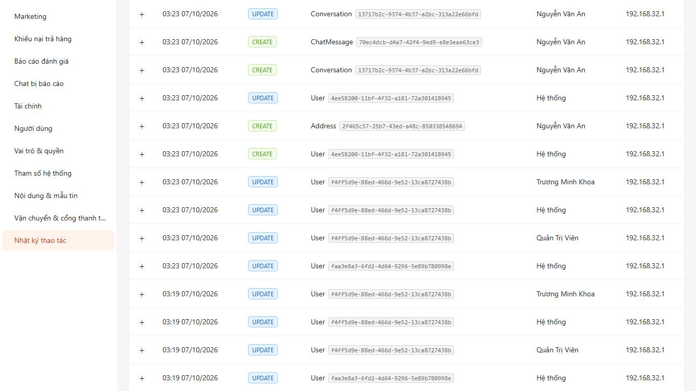

## 7. Cấu hình và nội dung

*Tham số hệ thống* (theo nhóm, có lịch sử thay đổi; đổi lịch chạy việc nền có hiệu lực ngay): tên sàn, pháp nhân, hotline, hạn thanh
toán, hạn tự hoàn thành, hạn trả hàng, phí, ngưỡng COD, xu, Flash Sale…
*Nội dung & mẫu tin*: trang tĩnh (Điều khoản, Quy chế hoạt động, Chính sách bảo mật, Trả hàng…), trung tâm trợ giúp, **mẫu tin**:
OTP qua SMS / email, thư thông báo và **mẫu thông báo từng sự kiện đơn hàng** cho người mua và cho shop (biến `{{code}}`,
`{{total}}`, `{{shop}}`, `{{note}}`, `{{deadline}}`).
*Vận chuyển & cổng thanh toán*: bật / tắt từng đơn vị vận chuyển và cổng.

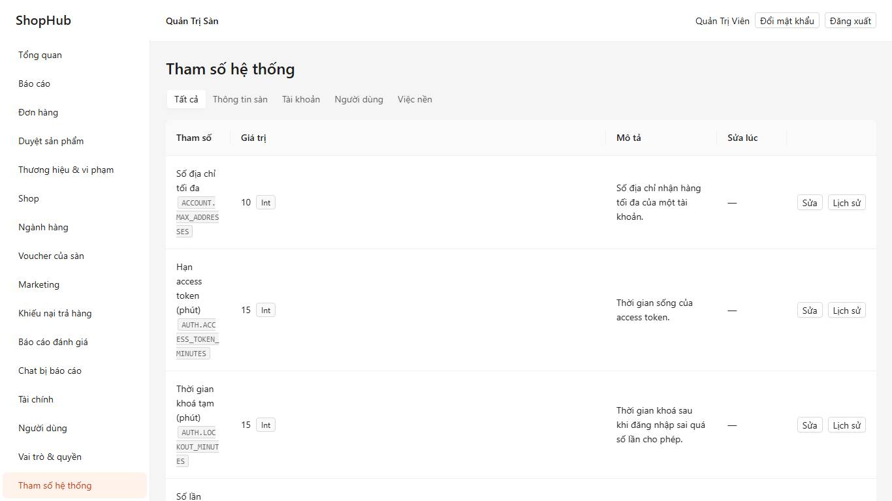
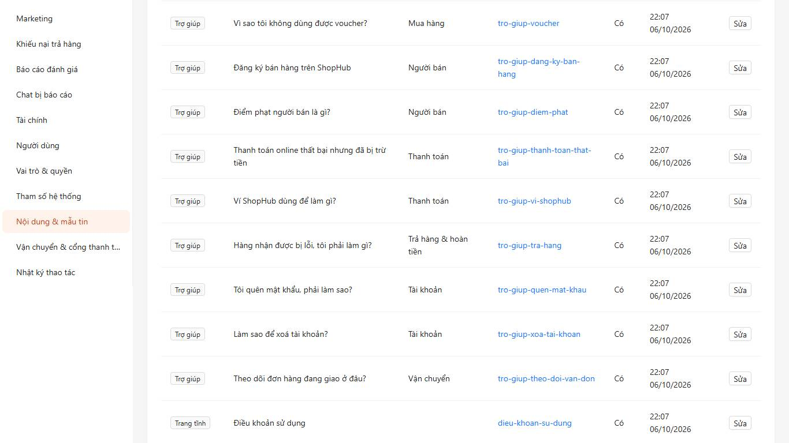
