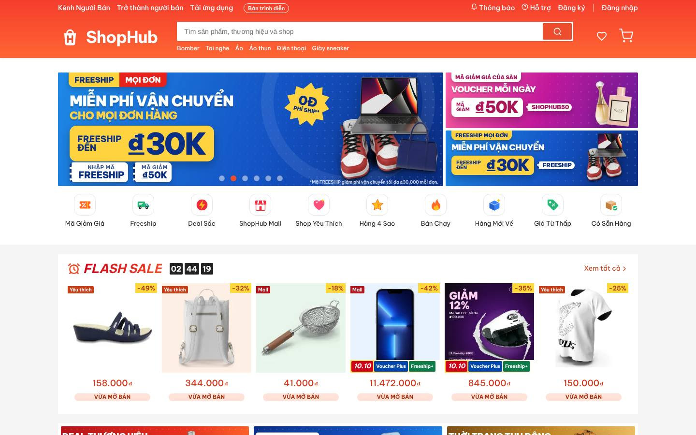
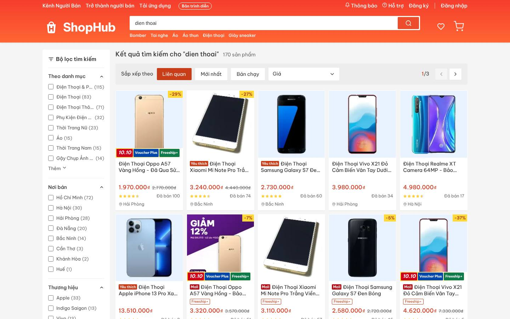
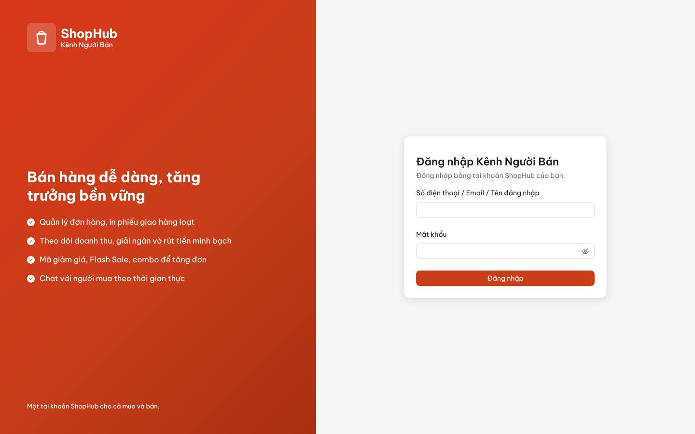
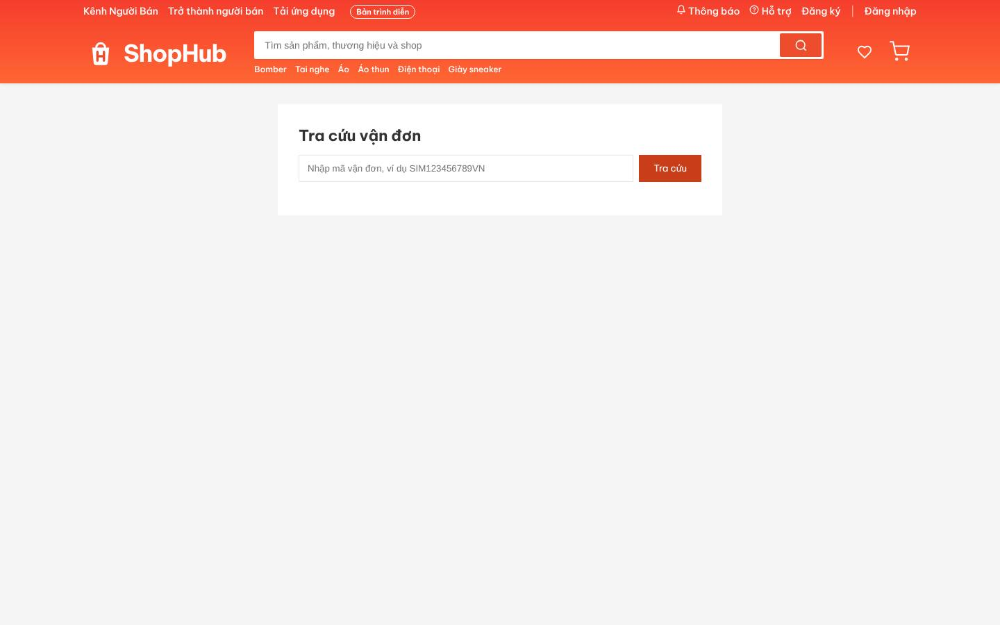
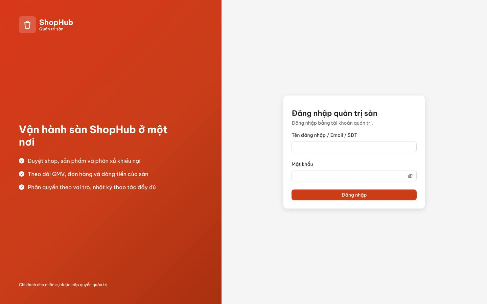
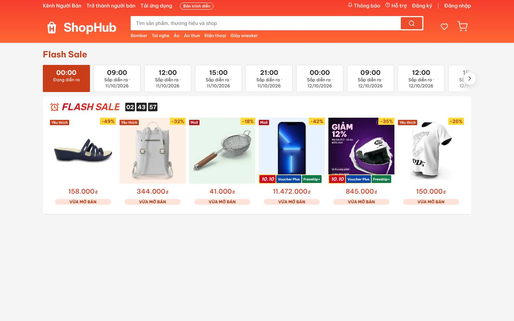
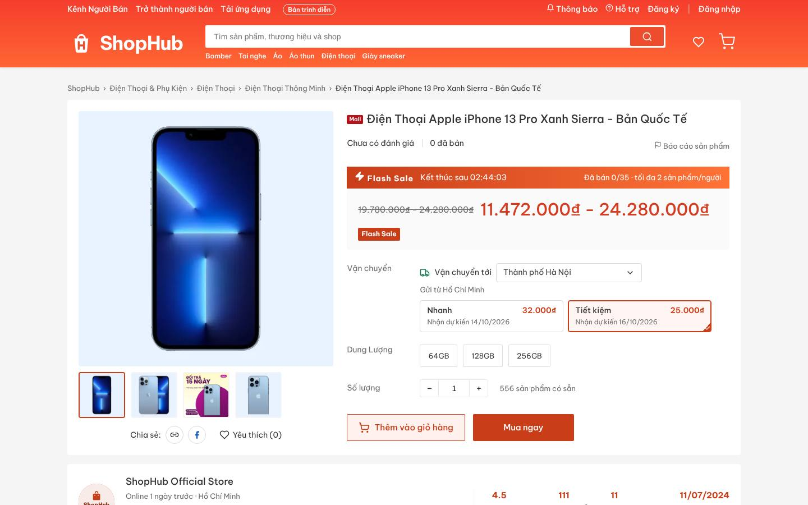

# 10 — Kịch bản trình diễn 10 phút

Đi một vòng trọn: **người mua → người bán → quản trị**, trên site thật https://shophub.bluestar.com.vn ở chế độ
`SITE.MODE = demo` (cổng thanh toán và hãng vận chuyển giả lập; docs/00 #198). Mỗi bước ghi đường dẫn, việc bấm và
điều cần chỉ cho người xem. Chi tiết từng màn hình: docs/01, 02, 03.

> **Mật khẩu:** lấy trong `~/apps/shophub/seed-accounts.txt` trên VM (quyền 600, tạo lại sau mỗi lần `--reseed`).
> Không ghi mật khẩu vào tài liệu, slide hay tin nhắn.

## 0. Chuẩn bị (5 phút, trước buổi)

| Việc | Ở đâu | Ghi chú |
|---|---|---|
| Lấy mật khẩu của `admin`, người mua `0900000001`, chủ shop `0900000101` | VM: `cat ~/apps/shophub/seed-accounts.txt` | Nếu mật khẩu `admin` đã đổi sau lần nạp đầu thì dùng mật khẩu hiện hành |
| Mở **ba cửa sổ trình duyệt tách biệt**: thường, ẩn danh, trình duyệt khác (hoặc ba hồ sơ Chrome) | | Ba site chung một tên miền và **chung cookie đăng nhập**. Hai vai trong cùng một cửa sổ sẽ đăng xuất nhau |
| Cho hãng vận chuyển giả lập chạy nhanh: `LOGISTICS.SIM_STEP_SECONDS` = **20** | `/admin/tham-so`, nhóm Logistics | Mặc định 120 giây một bước (lấy hàng → trung chuyển → đang giao → đã giao ≈ 8 phút). Với 20 giây còn khoảng 1 phút 20. **Nhớ trả về 120 sau buổi** |
| Kiểm `SITE.MODE` = `demo` | `/admin/tham-so`, nhóm SITE | Ở `live` cổng giả lập bị ẩn |
| Người mua `0900000001` có địa chỉ mặc định | `/tai-khoan/dia-chi` | Dữ liệu mẫu đã có. Nếu trống thì thêm một địa chỉ trước |

## 1. Người mua — khách chưa đăng nhập (2 phút) · cửa sổ 1

| # | Đường dẫn | Làm gì | Chỉ cho người xem |
|---|---|---|---|
| 1.1 | `/` | Cuộn trang chủ | Banner do quản trị đặt lịch. Flash Sale đếm ngược theo **giờ máy chủ**, thanh "Đã bán" là số suất đã bán thật. "Gợi ý hôm nay" |
| 1.2 | `/tim-kiem?q=dien%20thoai` | Gõ **dien thoai** (không dấu) vào ô tìm | Kết quả "Điện thoại…" có dấu. Facet bên trái có **số đếm thật**. Bấm một nơi bán, số kết quả đổi theo |
| 1.3 | Bấm một sản phẩm có phân loại | Bấm "Thêm vào giỏ" khi **chưa chọn** phân loại → bị nhắc. Chọn phân loại rồi thêm | Lựa chọn hết hàng mờ đi. Phí ship ước tính theo địa chỉ. Khối shop có số liệu thật |
| 1.4 | Thêm một sản phẩm của **shop thứ hai** | | Giỏ khách lưu trên máy chủ theo cookie, chưa cần tài khoản |

## 2. Người mua — đăng nhập và đặt hàng (2 phút) · cửa sổ 1

| # | Đường dẫn | Làm gì | Chỉ cho người xem |
|---|---|---|---|
| 2.1 | `/dang-nhap` | Đăng nhập `0900000001`. Thử một lần **sai mật khẩu** trước | Mật khẩu sai bị từ chối. Đăng nhập xong, giỏ khách **gộp** vào giỏ tài khoản |
| 2.2 | `/gio-hang` | Tick cả hai shop → "Mua hàng" | Giỏ **nhóm theo shop**, chỉ dòng được tick mới tính tiền |
| 2.3 | `/thanh-toan` | Voucher sàn: chọn **FREESHIP** (miễn ship, tối đa 30.000₫) và **SHOPHUB50** (giảm 50.000₫, đơn từ 250.000₫). Bật Xu nếu có | Mã không dùng được vẫn hiện, kèm lý do (vd. SALE12 cần đơn từ 500.000₫). Mọi con số do máy chủ tính (PricingEngine) |
| 2.4 | | Chọn **Thẻ / Ví điện tử (cổng thanh toán giả lập)** → "Đặt hàng" | Bấm hai lần cũng chỉ ra một checkout (Idempotency-Key) |
| 2.5 | `/cong-thanh-toan/…` | Bấm **Thành công** | Trang SimPay gọi webhook như cổng thật. Đơn chỉ đổi trạng thái khi webhook về, không dựa vào trang "quay về" |
| 2.6 | `/dat-hang-thanh-cong` | Ghi lại **hai mã đơn** `SH…` | **Mỗi shop một đơn**, mỗi đơn một phí ship riêng |

> Muốn cho thấy nhả kho thì đặt thêm một đơn, ở bước 2.5 bấm **Thất bại** hoặc **Bỏ đi**: đơn bị huỷ, tồn kho được
> nhả. Bỏ đi thì chờ hết hạn trả tiền (mặc định 15 phút).

## 3. Người bán — xử lý đơn (3 phút) · cửa sổ 2

| # | Đường dẫn | Làm gì | Chỉ cho người xem |
|---|---|---|---|
| 3.1 | `/seller/` | Đăng nhập `0900000101` (chủ shop mẫu). Chọn shop ở ô đầu trang, đúng shop của một trong hai đơn | Một tài khoản ShopHub vừa mua vừa bán. Một chủ shop mẫu có thể có nhiều shop |
| 3.2 | `/seller/tong-quan` | | Việc cần làm (chờ xác nhận, chờ lấy hàng, trả hàng…), doanh số hôm nay / 7 / 30 ngày, điểm phạt |
| 3.3 | `/seller/don-hang` | Tìm mã đơn vừa đặt → **Chuẩn bị hàng** → chọn lấy hàng tận nơi → **In phiếu** | Hệ thống sinh vận đơn. Phiếu giao là PDF có mã vạch. Có in hàng loạt và phiếu soạn hàng gộp nhiều đơn |
| 3.4 | (đợi khoảng 1 phút) | Làm mới danh sách | Hãng giả lập đẩy trạng thái theo thời gian: đã lấy → đang giao → đã giao |
| 3.5 | `/seller/san-pham` | Mở một sản phẩm 2 tầng phân loại | Bảng SKU: giá / tồn / mã SKU từng dòng. Tồn kho có ba số (thực có, đang giữ, khả dụng) |
| 3.6 | `/seller/tai-chinh` | | Tiền **chờ giải ngân** / **đã giải ngân**, chi tiết phí từng đơn. Số dư là tổng bút toán của sổ cái |

## 4. Người mua — nhận hàng và đánh giá (1 phút) · cửa sổ 1

| # | Đường dẫn | Làm gì | Chỉ cho người xem |
|---|---|---|---|
| 4.1 | `/tai-khoan/don-mua/<mã đơn>` | Mở đơn vừa đặt | Dòng thời gian trạng thái và **hành trình vận đơn** từ hãng giả lập |
| 4.2 | `/tra-cuu-van-don/<mã vận đơn>` | Mở ở cửa sổ ẩn danh (không đăng nhập) | Tra cứu công khai theo mã vận đơn |
| 4.3 | `/tai-khoan/don-mua/<mã đơn>` | Khi đơn "Đã giao": **Đã nhận được hàng** → **Đánh giá** (5 sao, chữ, một ảnh) | Chỉ đơn hoàn thành mới đánh giá được. Điểm sản phẩm tính lại từ dữ liệu gốc. Tiền của shop chuyển sang chờ giải ngân |

> Nếu hãng giả lập chưa kịp tới "Đã giao": mở `/tai-khoan/don-mua`, tab **Hoàn thành**. Dữ liệu mẫu có sẵn đơn đã giao /
> hoàn thành để chỉ nút Đánh giá và Trả hàng.

## 5. Quản trị sàn (2 phút) · cửa sổ 3

| # | Đường dẫn | Làm gì | Chỉ cho người xem |
|---|---|---|---|
| 5.1 | `/admin/` | Đăng nhập `admin` | Menu theo quyền (RBAC). Ba nhóm Vận hành / Kinh doanh / Hệ thống |
| 5.2 | `/admin/` (Tổng quan) | | GMV, số đơn, tỉ lệ huỷ / hoàn, doanh thu phí, việc chờ xử lý |
| 5.3 | `/admin/don-hang` | Tìm mã đơn của bước 2.6 | Toàn bộ lịch sử trạng thái, thanh toán (webhook), vận đơn của một đơn |
| 5.4 | `/admin/duyet-san-pham` | Mở hàng đợi | Duyệt / từ chối / yêu cầu sửa kèm lý do. Sản phẩm dính từ khoá cấm bị gắn cờ |
| 5.5 | `/admin/bao-cao` | Chọn "GMV theo ngành", bấm xuất Excel | Mỗi báo cáo có bảng, biểu đồ và xuất Excel / PDF. Số khớp truy vấn kiểm chứng |
| 5.6 | `/admin/kiem-tra-mo-ban` | | Danh sách điều kiện trước khi bán thật (docs/09). Ở chế độ demo, các mục chặn còn đỏ |
| 5.7 | `/admin/nhat-ky` | Lọc theo người `admin` | Mọi thao tác quản trị đều được ghi, có xem khác biệt cũ / mới |

## 6. Sau buổi

1. `/admin/tham-so`: trả `LOGISTICS.SIM_STEP_SECONDS` về **120**.
2. Đơn trình diễn để nguyên, vì chúng đi qua đúng máy trạng thái và sổ cái. Không xoá tay trong CSDL.
3. Nếu đã cho ai xem mật khẩu mẫu: đổi mật khẩu các tài khoản đó, hoặc `deploy-vm.sh --reseed` để sinh mật khẩu mới
   (docs/04, mục triển khai VM). Lưu ý `--reseed` xoá cả dữ liệu đã tạo trong buổi.

## Câu hỏi hay gặp khi trình diễn

| Câu hỏi | Trả lời ngắn | Chỉ ở đâu |
|---|---|---|
| "Đã bán", số sao có phải số bịa? | Không. Tính lại từ đơn và đánh giá thật. Ở bản demo, doanh số mẫu do việc nền đặt đơn COD thật qua đủ các bước (docs/00 #205) | Sản phẩm → "Đã bán"; quản trị → Đơn hàng |
| Hai người cùng mua món cuối? | Giữ hàng bằng một câu UPDATE có điều kiện. Ràng buộc CHECK ở CSDL. Có phép thử 50 yêu cầu song song | docs/06, `dotnet test` |
| Thanh toán thật thì sao? | VNPay / MoMo / ZaloPay sandbox đã có mã, chờ tài khoản sandbox để chạy thử | docs/04 "Chạy với sandbox thật" |
| Có app điện thoại không? | Đợt sau (Flutter). API đã là REST + JWT, sẵn `device_tokens` | `/tai-ung-dung` |

*Ảnh chụp ngày 10/10/2026 từ site thật, trước G-VIS vòng 2 và trước G5 (màu header của Kênh Người Bán / quản trị). Trang
chủ và trang sản phẩm sẽ đổi sau vòng 2. Chụp lại bằng `e2e/tools/screenshots.cjs` khi cần.*
